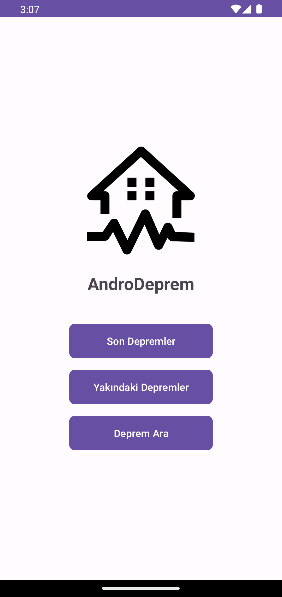
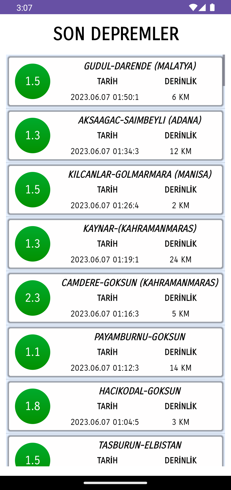
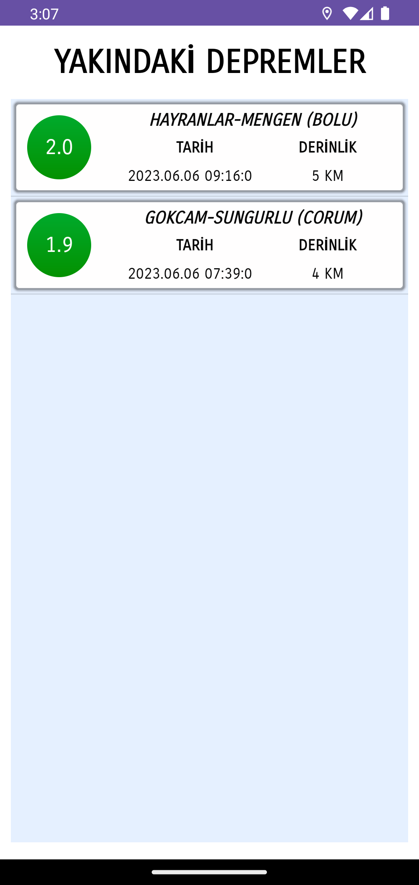
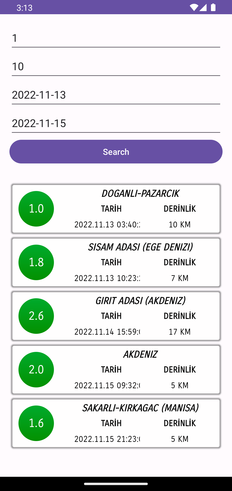

# AndroDeprem

AndroDeprem, kullanıcılara son deprem bilgilerini sunmayı amaçlayan bir Android mobil uygulamasıdır. Bu uygulama kullanıcılara güncel deprem verilerini görüntüleme, yakındaki depremleri izleme ve deprem arşivinde arama yapma imkanı sağlar.

## Özellikler

- Güncel deprem verilerini görüntüleme: Kullanıcılar uygulama üzerinden en son meydana gelen depremlerin bilgilerini alabilirler. Bu bilgiler arasında deprem büyüklüğü, konumu, zamanı ve derinliği bulunur.

- Yakındaki depremleri izleme: Kullanıcıların bulundukları konuma yakın gerçekleşen depremleri görebilmelerine olanak tanır. Uygulama, konum hizmetlerini kullanarak kullanıcının coğrafi konumunu tespit eder ve yakındaki depremleri harita üzerinde gösterir.

- Deprem arşivinde arama yapma: Kullanıcılar, deprem arşivindeki geçmiş depremleri tarih, konum veya büyüklük gibi parametrelerle filtreleyebilir ve istedikleri depremi bulabilirler.

## Kurulum

1. Bu projeyi klonlayın veya ZIP olarak indirin.
2. Android Studio'yu açın ve projeyi "Open an existing Android Studio project" seçeneğiyle açın.
3. Proje dosyasını seçin ve açın.
4. Gerekli bağımlılıkları indirmek ve projeyi derlemek için Gradle'ı kullanın.
5. Emülatörde veya fiziksel bir cihazda uygulamayı çalıştırın.

## Kullanılan Teknolojiler ve Araçlar

- Java Programlama Dili
- Android Studio
- Android SDK
- JSON (JavaScript Object Notation)
- Kandilli Rasathanesi API
- HTTP İstekleri
- Konum Hizmetleri
- AsyncTask

## Ana Sayfa

  

## Son Depremler

  

## Yakındaki Depremler

  

## Deprem Arama

  

## Lisans

Bu proje, MIT Lisansı altında lisanslanmıştır. Daha fazla bilgi için `LICENSE` dosyasını inceleyin.
